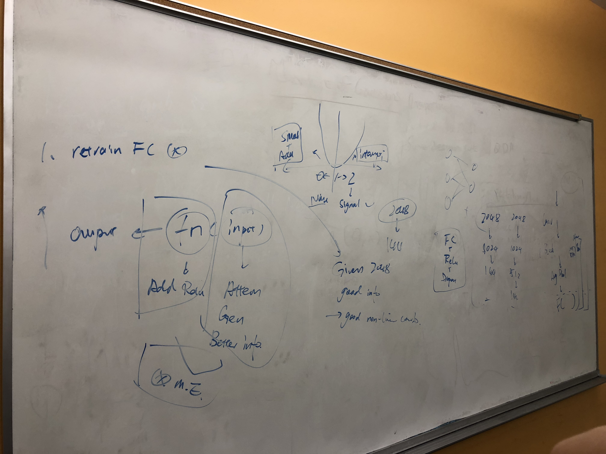

### File Structure

#### Conv block with attention
- `AttentionModule.ipynb`
- `AttentionModule.py`
- `AttentionModuleV2.ipynb`

#### Data Visualization
- `Vis-V1.ipynb` shows the grid of attention is perserved across independent runs.
- `ckpt` contains the data for visualization 

#### ResnetConvAttention
- ResnetConvAttention.ipynb
- ResnetConvAttentionV2.ipynb
- ResnetConvAttentionV3.ipynb
- ResnetConvAttentionV4.ipynb
- ResnetConvAttentionV5.ipynb

#### Misc Raw Data
- `loss_history/fc_9_epoch.txt`
- `res_fc_attn_train.py`

#### Notes

